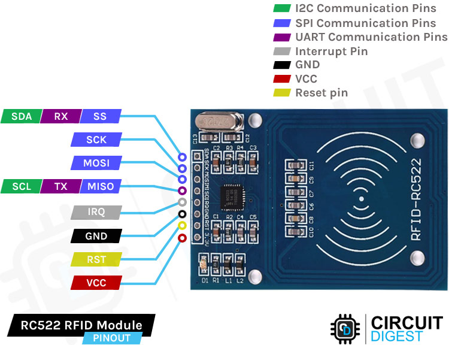
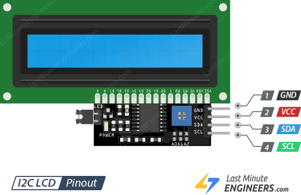

# Absensi RIFD

## Deskrisi Singkat Alat

Source untuk membuat absensi menggunakan RFID, alat ini menggunakan ESP32 sebagai mikrokontroler, RIFD sebagai _card reader_, dan LCD untuk menampilkan informasi. penggunaan ESP32 karena yang tersedia module wifi untuk mengirim data ke server.

## Pinout ESP32

(Sumber: [upesy.com](https://www.upesy.com/blogs/tutorials/esp32-pinout-reference-gpio-pins-ultimate-guide))

 

## Pinout RFID RC522

(Sumber: [circuitdigest.com](https://circuitdigest.com/microcontroller-projects/interfacing-rfid-reader-module-with-arduino))

 

## Pinout LCD I2C

(Sumber: [lastminuteengineers.com](https://lastminuteengineers.com/i2c-lcd-arduino-tutorial/))

 

## Pin RFID to ESP32 dan Pin LCD_I2C to ESP32

<table>
<tr>
    <td>
        <table>
            <tr>
                <th>RFID</th>
                <th>--></th>
                <th>ESP32</th>
            </tr>
            <tr>
                <td>SDA</td>
                <td>--></td>
                <td>GPIO05</td>
            </tr>
            <tr>
                <td>SCK</td>
                <td>--></td>
                <td>GPIO18</td>
            </tr>
            <tr>
                <td>MOSI</td>
                <td>--></td>
                <td>GPIO23</td>
            </tr>
            <tr>
                <td>MISO</td>
                <td>--></td>
                <td>GPIO19</td>
            </tr>
            <tr>
                <td>RST</td>
                <td>--></td>
                <td>GPIO27</td>
            </tr>
            <tr>
                <td>3.3V</td>
                <td>--></td>
                <td>3.3V</td>
            </tr>
            <tr>
                <td>GND</td>
                <td>--></td>
                <td>GND</td>
            </tr>
        </table>
    </td>
    <td>
    </td>
    <td style="vertical-align: top">
        <table>
            <tr>
                <th>LCD_I2C</th>
                <th>--></th>
                <th>ESP32</th>
            </tr>
            <tr>
                <td>SCL</td>
                <td>--></td>
                <td>GPIO22(I2C_SCL)</td>
            </tr>
            <tr>
                <td>SDA</td>
                <td>--></td>
                <td>GPIO21(I2C_SDA)</td>
            </tr>
            <tr>
                <td>3.3V</td>
                <td>--></td>
                <td>3.3V</td>
            </tr>
            <tr>
                <td>GND</td>
                <td>--></td>
                <td>GND</td>
            </tr>
        </table>
    </td>
</tr>
</table>

[hello](https://www.google.com)