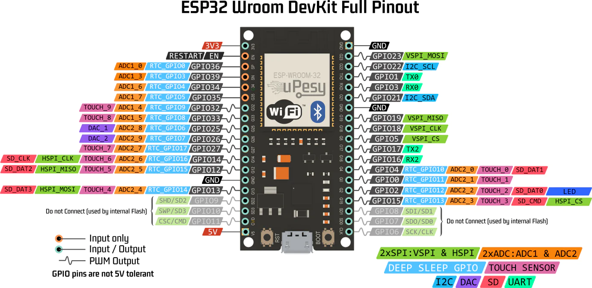

# Absensi RIFD

## Deskrisi Singkat Alat

Source untuk membuat absensi menggunakan RFID, alat ini menggunakan ESP32 sebagai mikrokontroler, RIFD sebagai _card reader_, dan LCD untuk menampilkan informasi. penggunaan ESP32 karena yang tersedia module wifi untuk mengirim data ke server.

## Pinout ESP32

## Pin RFID to ESP32

<table>
    <tr>
        <td>RFID</td>
        <td>--></td>
        <td>ESP32</td>
    </tr>
    <tr>
        <td>SDA</td>
        <td>--></td>
        <td>GPIO05</td>
    </tr>
    <tr>
        <td>SCK</td>
        <td>--></td>
        <td>GPIO18</td>
    </tr>
    <tr>
        <td>MOSI</td>
        <td>--></td>
        <td>GPIO23</td>
    </tr>
    <tr>
        <td>MISO</td>
        <td>--></td>
        <td>GPIO19</td>
    </tr>
    <tr>
        <td>RST</td>
        <td>--></td>
        <td>GPIO27</td>
    </tr>
    <tr>
        <td>3.3V</td>
        <td>--></td>
        <td>3.3V</td>
    </tr>
    <tr>
        <td>GND</td>
        <td>--></td>
        <td>GND</td>
    </tr>
</table>

## Pin LCD_I2C to ESP32

<table>
    <tr>
        <td>LCD_I2C</td>
        <td>--></td>
        <td>ESP32</td>
    </tr>
    <tr>
        <td>SCL</td>
        <td>--></td>
        <td>GPIO22(I2C_SCL)</td>
    </tr>
    <tr>
        <td>SDA</td>
        <td>--></td>
        <td>GPIO21(I2C_SDA)</td>
    </tr>
    <tr>
        <td>3.3V</td>
        <td>--></td>
        <td>3.3V</td>
    </tr>
    <tr>
        <td>GND</td>
        <td>--></td>
        <td>GND</td>
    </tr>
</table>
